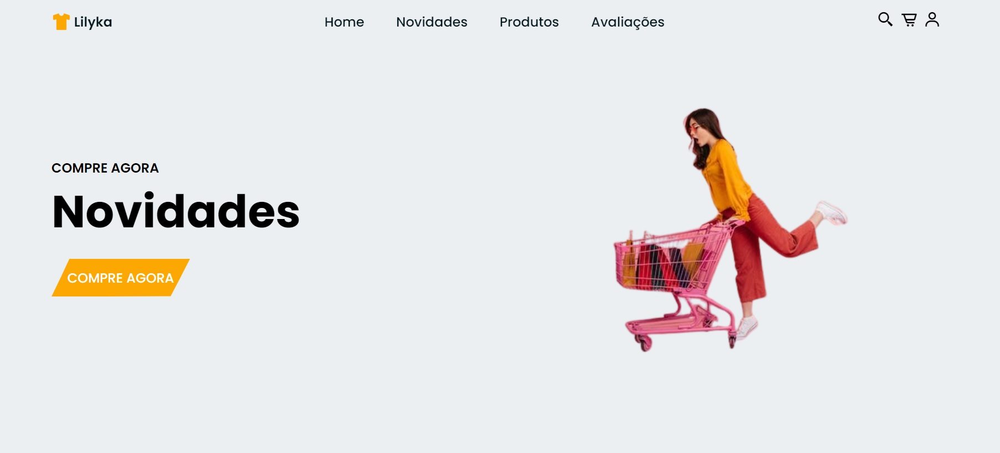
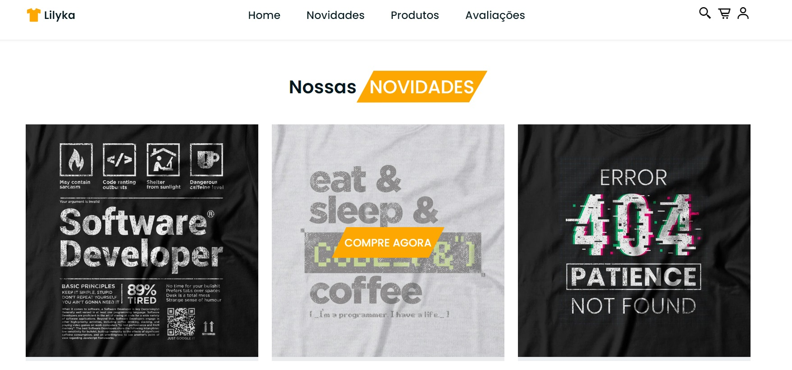
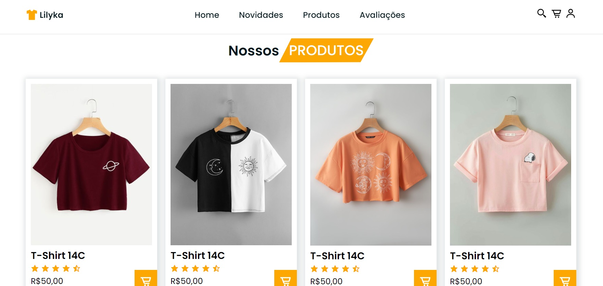
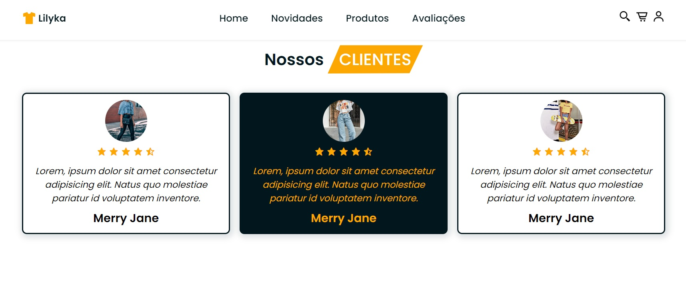
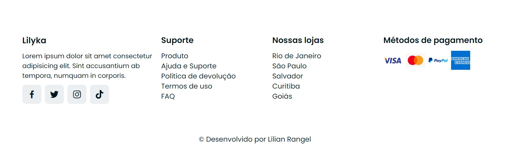

<h1 align="center">Projeto E-commerce</h1>  

Oitavo projeto da Mentoria Conquiste sua Vaga entregue num prazo de 7 dias. 

<h2 align="center">Aprendizados nesse projeto 🎯</h2>
O objetivo é continuar treinando e aprofundando os conhecimentos em HTML5, CSS3 e Vanilla JavaScript.
Com esse projeto aprendi sobre scroll-behavior, clip-path, transform scaleX e window.scrollY.

<h2 align="center">Tecnologias utilizadas 🛠</h2> 

<h2 align="center">Deploy 👨🏽‍💻</h2>
<a href="https://lilian-rangel-ecommerce.netlify.app/" target="_blank">Confira o projeto nesse link</a>

<h2 align="center">Prints da página</h2>
 

<h2 align="center">Demo desktop</h2>

<h2 align="center">Demo Responsivo para mobile</h2>

<h2 align="center"> Contributor 💻</h2>
<table align="center">
<tbody>
<tr>
<td align="center">
<a href="https://github.com/lilian-rangel" rel="nofollow"> <b>Lilian Rangel</b></a>
</td>
</tr>
</tbody>
</table>
